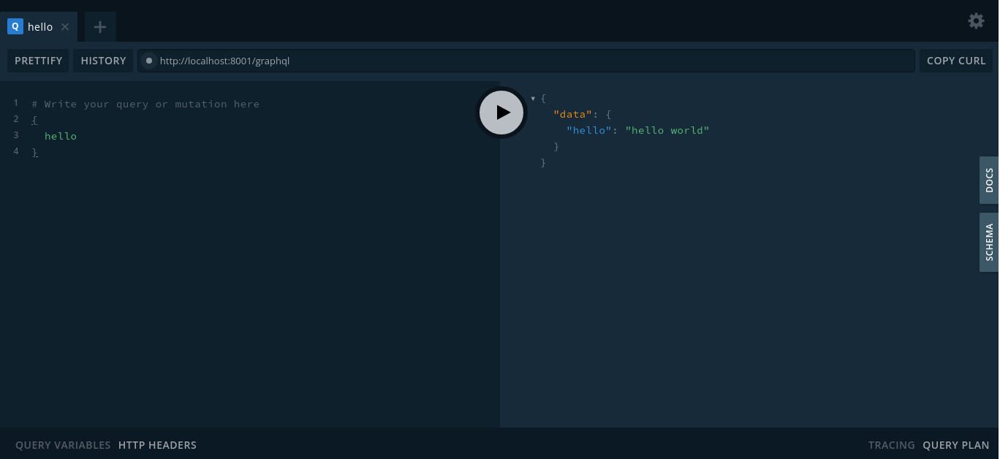

# Study logs

## August 22 2020

### node/typescript setup

```
yarn add -D @types/node
yarn add -D ts-node
yarn add -D nodemon
```

### mikroORM setup

```
yarn add -D @mikro-orm/cli @mikro-orm/core @mikro-orm/migrations @mikro-orm/postgresql pg


//--- mikro-orm migration command ---//
npx mikro-orm migration:create   # Create new migration with current schema diff
npx mikro-orm migration:up       # Migrate up to the latest version
npx mikro-orm migration:down     # Migrate one step down
npx mikro-orm migration:list     # List all executed migrations
npx mikro-orm migration:pending  # List all pending migrations
```

### Apollo server Express setup

```
yarn add express apollo-server-express graphql type-graphql

```
